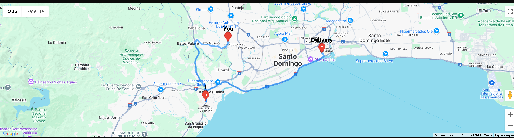
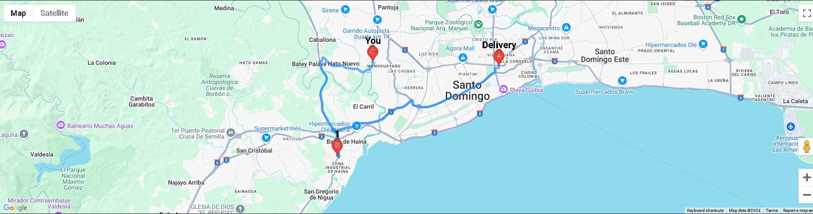

# MapRoute

MapRoute is a web application built using [Next.js](https://nextjs.org/) and [React](https://reactjs.org/). It simulates a delivery route on a map, showing customer and delivery positions with waypoints. The application uses the Google Maps API to display and update the route in real-time.

## Features

- Real-time simulation of a delivery route.
- Dynamic waypoints and delivery positions.
- Geolocation support to track the user's current position.
- Customizable delivery routes for different cities.

## Demo

You can see a working example of the app [here](#). (Include a link if you have a live demo or deployment)

## Installation

1. Clone the repository:
   ```bash
   git clone https://github.com/AngelGuante/maproute.git
   cd maproute
2. Install the dependencies:
    npm install
3. Set up your Google Maps API:
    * Go to the Google Cloud Console.
    * Enable the Google Maps JavaScript API.
    * Create or use an existing API key.
    * Optionally, create a Map ID for custom map styles.
4. Add your mapId and googleMapsApiKey:
    * Create a .env.local file in the root of the project and add your keys like this:
    ```bash
    NEXT_PUBLIC_GOOGLE_MAPS_API_KEY=your_google_maps_api_key (or, in Map.js replace googleMapsApiKey="<GoogleMapsApiKey>")
    NEXT_PUBLIC_GOOGLE_MAPS_MAP_ID=your_map_id
5. Start the development server:
    ```bash
    npm run dev
6. How it looks like:
   
   

The app will be running at http://localhost:3000.
